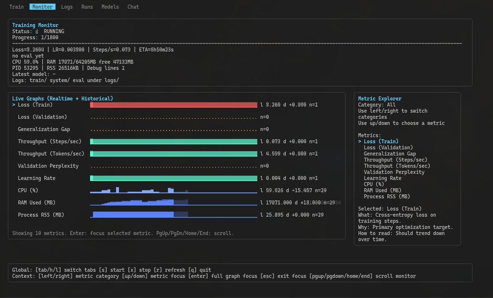

# MicroGPT - Go Edition



MicroGPT is a Go-first local training project with a unified terminal UI for:

- configuring training
- running/monitoring jobs
- reviewing run artifacts
- testing checkpoints in chat

This is the top-level project guide. The runnable app lives in `go/`.

## Attribution

This project builds on ideas popularized by Andrej Karpathy.  
Original reference gist:

- <https://gist.github.com/karpathy/8627fe009c40f57531cb18360106ce95>

Karpathy is credited here as the original creator/inspiration for the foundational approach.

## Project Layout

- `go/`: main application code, TUI, training runtime, artifacts
- `docs/go/`: user-facing docs (install, usage, training hub, datasets)
- `docs/`: legacy/transition docs

## Quick Start

```bash
cd go
go mod tidy
./checks.sh
go run ./cmd/mircogpt-tui
```

## TUI Tabs

- `Train`: editable config for all runtime/training variables
- `Monitor`: live metrics/graphs + metric explorer
- `Logs`: live log stream (scrollable)
- `Runs`: grouped run artifacts
- `Models`: available checkpoints
- `Chat`: checkpoint testing in a chat loop

## Common Controls

- `tab` / `shift+tab` (`l` / `h`): switch tabs
- `s`: start training
- `x`: stop training
- `r`: refresh lists
- `q`: quit

Train:

- `j/k`: select field
- `e` or `enter`: edit field
- `space`: cycle bool/choice field
- `f`: dataset picker (on `DATASET_PATH`)
- `1/2/3`: apply preset
- `pgup/pgdown/home/end`: scroll

Monitor:

- `left/right`: metric category
- `up/down`: metric selection
- `enter`: focused graph mode
- `esc`: exit focus mode
- `pgup/pgdown/home/end`: scroll

Logs:

- `pgup/pgdown/home/end`: scroll
- `c`: clear logs

Chat:

- `enter`: start typing/send
- `esc`: exit typing
- `p`: edit checkpoint path
- `L`: load latest checkpoint
- `[` `]`: temperature down/up
- `-` `=`: max tokens down/up

## CLI Commands

Train directly:

```bash
go run .
```

Validate dataset:

```bash
go run . validate-dataset
```

GPU readiness check:

```bash
go run . gpu-check
```

One-shot chat:

```bash
go run . chat-once models/latest_checkpoint.json "Help me prioritize my day"
```

## Dataset

Default dataset path:

- `go/datasets/raw/databricks-dolly-15k.jsonl`

The runtime supports schema-based JSONL and compatibility mapping for Dolly-style rows.

## Training Artifacts

Logs:

- `go/logs/train/tui_train_<run-tag>.log`
- `go/logs/system/tui_system_metrics_<run-tag>.csv`
- `go/logs/eval/tui_eval_metrics_<run-tag>.csv`
- `go/logs/runs/run_<run-tag>.txt`
- `go/logs/train_latest.log`

Models:

- `go/models/ckpt_<run-tag>_step<steps>_valloss<loss>.json`
- `go/models/latest_checkpoint.json`
- `go/models/best_checkpoint.json`

## Recommended Baseline (Coherence-first on CPU)

- `TOKENIZER=bpe`, `BPE_ENCODING=cl100k_base`
- `TOKEN_VOCAB_SIZE=3072`
- `N_LAYER=2`, `N_EMBD=80`, `N_HEAD=4`, `BLOCK_SIZE=128`
- `NUM_STEPS=1500`, `LEARNING_RATE=0.0025`
- `VAL_SPLIT=0.10`, `EVAL_INTERVAL=100`, `EVAL_STEPS=64`
- `EARLY_STOP_PATIENCE=12`
- `TRAIN_DEVICE=cpu`

Use `TOKEN_VOCAB_SIZE=4096`, `N_EMBD=96`, `NUM_STEPS=3000` for longer runs when you want the best quality this machine can reasonably produce.

## Parameter Cheat Sheet (Plain English)

- `TOKEN_VOCAB_SIZE`: vocabulary detail level; higher usually improves wording but takes longer.
- `N_LAYER` / `N_EMBD`: model depth/width; higher improves capacity and coherence but slows training.
- `BLOCK_SIZE`: how much context the model can see at once.
- `NUM_STEPS`: training duration; more steps usually improve responses.
- `LEARNING_RATE`: how aggressive training updates are; too high is noisy, too low is slow.
- `EVAL_STEPS`: validation reliability; low values are noisy, higher values are more trustworthy.
- `TEMPERATURE`: creativity vs stability at generation time (lower is more coherent).
- `TOP_K` / `TOP_P` / `REPETITION_PENALTY`: controls randomness and repetition in responses.

## Documentation Map

- `docs/go/INSTALLATION.md`
- `docs/go/TRAINING_HUB_GUIDE.md`
- `docs/go/DATASET_GUIDE.md`
- `docs/go/EXAMPLE_DATASETS.md`
- `go/CHANGELOG.md`
