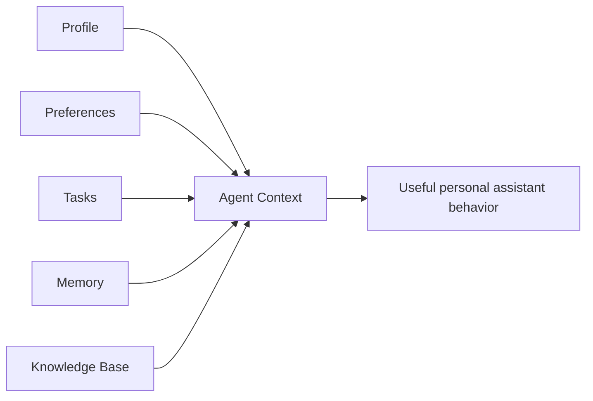
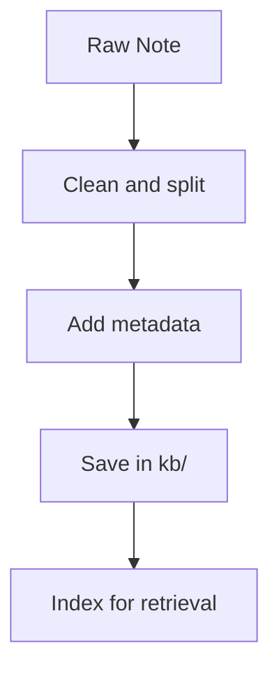

# Personal AI Agent Dataset Guide

This guide defines how to build a practical dataset for a personal AI agent.

## 1. Dataset goal

For a personal agent, the dataset should capture your real context:
- who you are
- how you prefer responses
- what you are working on
- what happened recently
- what reference knowledge to use



## 2. Recommended structure

```text
agent-data/
  profile.json
  preferences.json
  tasks.json
  memory/
    events.jsonl
  kb/
    projects/
    personal/
    ops/
  examples/
    assistant_style.md
```

## 3. What each file stores

1. `profile.json`
- identity, roles, goals, constraints

2. `preferences.json`
- communication style
- output format defaults
- coding/workflow preferences

3. `tasks.json`
- active tasks, priorities, deadlines, blockers, next actions

4. `memory/events.jsonl`
- important timestamped events
- one JSON record per line

5. `kb/`
- durable notes, SOPs, project docs
- one topic per document

6. `examples/assistant_style.md`
- examples of responses you like/dislike

## 4. Metadata standard for KB docs

Add frontmatter:

```yaml
---
title: "Weekly Review SOP"
updated_at: "2026-02-17"
tags: [planning, ops]
source: "internal"
confidence: "high"
sensitivity: "low"
---
```



## 5. Ingestion workflow

1. Capture source notes/documents.
2. Normalize format (small atomic files).
3. Add metadata and tags.
4. Store in structured folders.
5. Re-index and test retrieval queries.

## 6. Quality checklist

Before adding data:
- single clear topic
- date present
- tags present
- no stale duplicate versions
- no secrets embedded
- clear confidence level when uncertain

## 7. Safety and privacy

- Keep API keys/passwords outside dataset files.
- Use encrypted secrets storage for credentials.
- Mark sensitive documents with `sensitivity: high`.
- Require confirmation for high-impact actions (email send, purchases, deletes).

## 8. Starter templates

### `profile.json`

```json
{
  "name": "Your Name",
  "roles": ["Founder", "Engineer"],
  "goals": {
    "short_term": ["Ship personal agent MVP"],
    "long_term": ["Automate weekly planning and reporting"]
  },
  "constraints": {
    "budget_monthly": 200,
    "tools": ["GitHub", "Calendar", "Notes"]
  }
}
```

### `preferences.json`

```json
{
  "communication_style": "concise",
  "default_output": "actionable_steps",
  "coding_preferences": {
    "language_priority": ["Python", "Go"],
    "tests_required": true
  }
}
```

### `memory/events.jsonl`

```json
{"timestamp":"2026-02-17T20:00:00Z","type":"project_update","summary":"Completed auth MVP","tags":["agent","milestone"],"confidence":"high"}
{"timestamp":"2026-02-18T02:00:00Z","type":"preference_update","summary":"Prefers bullet-point summaries","tags":["style"],"confidence":"high"}
```

### `tasks.json`

```json
[
  {
    "project": "Personal Agent",
    "task": "Integrate calendar",
    "status": "in_progress",
    "priority": "high",
    "due_date": "2026-02-21",
    "blockers": [],
    "next_action": "Implement OAuth callback"
  }
]
```

## 9. Priority order for improvements

1. Consistent structure
2. Better metadata
3. Better memory quality (important events only)
4. Fresh tasks
5. Better style examples

This order gives the largest quality gains before any model fine-tuning.

## 10. microgpt-go JSONL training file

For `go/main.go`, use:
- `go/assistant_dataset_train.jsonl`

Example:

```jsonl
{"record_type":"knowledge","text":"Summarize my top priorities for today"}
{"record_type":"qa","question":"What should I do first?","answer":"Start with the highest-impact task and clear one blocker."}
{"record_type":"chat","input":"Give me a planning template","output":"Top 3 priorities, time blocks, blockers, next actions."}
```

The Go dataset is strict and validates by `record_type` before training.

## 11. Checks and balances (required)

Before every training run:

```bash
cd go
./checks.sh
```

This enforces:
- formatting (`gofmt`)
- build success (`go build`)
- schema validation (`go run . validate-dataset`)
- JSON validity (`jq`)
- short runtime smoke test
