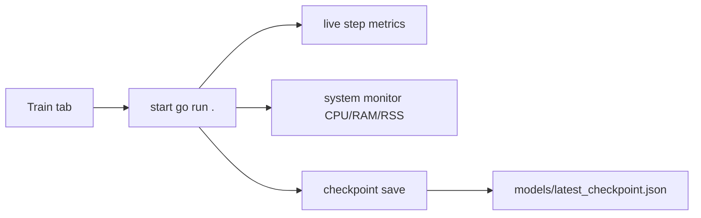
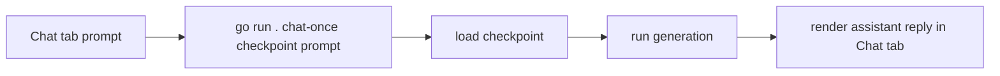

# MircoGPT-tui TUI Guide

## Purpose

One TUI for:
- training
- monitoring
- run/model artifacts
- chat testing

## Components

1. `go/cmd/mircogpt-tui/main.go`
2. `go/main.go` (`train`, `validate-dataset`, `chat-once`)

## Unified Hub Tabs

- `Train`: full variable editor + preflight validation
- `Monitor`: runtime system + step metrics + logs
- `Runs`: recent run log artifacts
- `Models`: saved checkpoint artifacts
- `Chat`: integrated inference test panel

## Variable Guidance (Selection-Based)

The `Train` tab shows contextual guidance for the selected variable (terminal equivalent of hover help):
- expected type
- valid range/allowed values
- behavior impact notes
- practical usage tips

## Training Console Flow

## Chat Flow (Integrated)

## Runtime Settings Coverage

- dataset/config: `DATASET_PATH`, `N_LAYER`, `N_EMBD`, `N_HEAD`, `BLOCK_SIZE`, `NUM_STEPS`
- optimizer: `LEARNING_RATE`, `BETA1`, `BETA2`, `EPS_ADAM`
- generation: `TEMPERATURE`, `SAMPLE_COUNT`
- runtime/logging: `TRAIN_DEVICE`, `METRIC_INTERVAL`, `LOG_LEVEL`, `VERBOSE`
- output: `MODEL_OUT_PATH`

Chat controls in tab:
- temperature: `[` `]`
- max tokens: `-` `=`

## Logs and Artifacts

- `go/logs/tui_train_<preset>_<timestamp>.log`
- `go/logs/tui_system_metrics_<preset>_<timestamp>.csv`
- `go/logs/train_latest.log`
- `go/models/checkpoint_<timestamp>.json`
- `go/models/latest_checkpoint.json`
